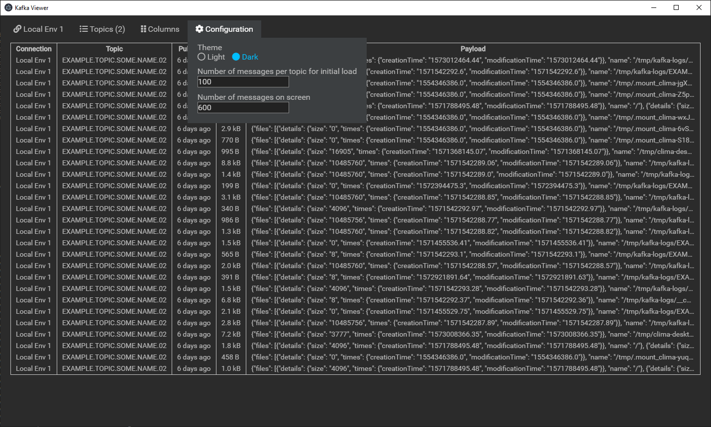
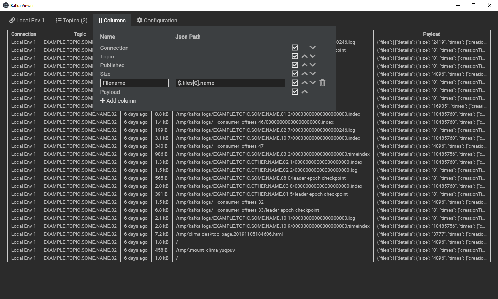
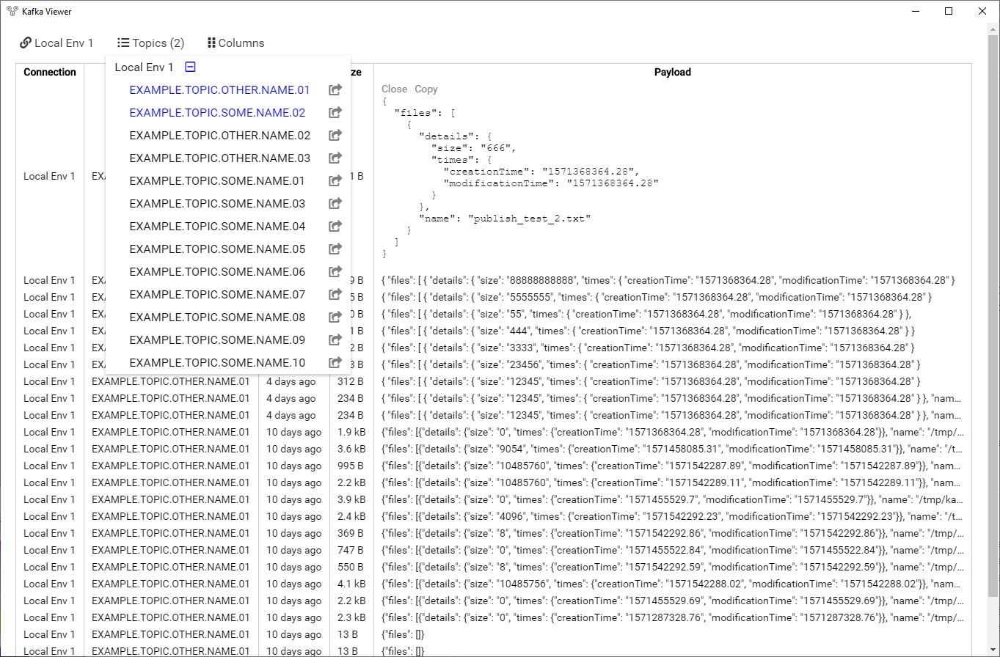

# kafka-viewer

A tool to view and publish JSON messages on Kafka.

## Download and execute

- Download zip with windows distribution/executable from https://glaucotools.s3-sa-east-1.amazonaws.com/kafka-viewer.zip
- Unzip on %APPDATA% folder and execute kafka-viewer.exe

## Screenshots

## Initial setup

1) Install nodejs and npm latest version
2) run npm install

PS: This project includes node-rdkafka, which is a wrapper over the C++ librdkafka binary library. Making a successful build of it may require some level of tinkering.  

## Build and execute locally

npm run electron-build

## Generate windows executable

npm run dist

## Notes

- This project includes node-rdkafka, which requires binary compilation and nodejs bindings specific to the nodejs version used. 
- After the bindings are generated on the electron packager command, the nodejs code will no longer run on regular non-electron nodejs.   
